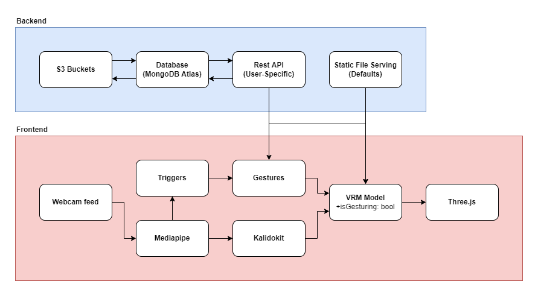

<h1 align="center">ventriloquist</h1>
<p align="center">ventriloquist is a browser-based VTubing app inspired by <a href="https://www.cs.purdue.edu/cgvlab/papers/popescu/2021ISMARAlterEchoPopescu.pdf">Alter Echo</a></p>
<p align="center">
    <i>
        <a href="https://github.com/belindanju">
            Tian Guo
        </a>
    </i>
</p>
<p align="center">
    <i>
        <a href="https://github.com/jhsul">
            Jack Sullivan
        </a>
    </i>
</p>

## Table of Contents

- [Introduction](#introduction)
- [Install Locally](#install-locally)
  - [Base Application](#base-application)
  - [Database (Optional)](#database--optional-)
- [Functionality](#functionality)
  - [Loose-Coupling Model](#loose-coupling-model)
  - [Control Flow](#control-flow)
  - [Packages](#packages)
  - [Gestures](#gestures)

## Introduction

This project both recreates and expands on [AlterEcho](https://www.cs.purdue.edu/cgvlab/papers/popescu/2021ISMARAlterEchoPopescu.pdf), an avatar-streamer model that supports both one-to-one motion capture and preset animations ("gestures") which are triggered either manually or with poses/facial expressions.

## Install Locally

Ventriloquist is eventually going to be hosted on a dedicated server, but it can easily be run locally.

### Base Application

You can install and run the base app locally by running the following commands in a shell:

```sh
# Clone and enter the repository
git clone https://github.com/cake-lab/ventriloquist
cd ventriloquist

# Install packages
npm i

# Start a local instance (localhost:3000)
npm run build
npm run start
```

### Database (Optional)

If you want your local installation to support user profiles, you will need to connect to a MongoDB Atlas cluster. Add your cluster authentication info to `.env.local`:

```sh
# .env.local
MONGODB_URI=<your mongo uri>
MONGODB_DB=<your db name>
```

## Functionality

### Loose-Coupling Model

The Alter Echo paper proposes a loose-coupling model between the user and the VTuber model. The model follows the user with one-to-one motion capture, but facial expressions and hand positions can trigger the model to perform preset animations ("gestures").

### Control Flow

There is one model loaded into a [three.js](https://threejs.org/) scene, and its controller switches between one-to-one motion capture and preset animations from [mixamo](https://www.mixamo.com/) based on user-defined triggers.



<p align="center"><i>Figure 1: Ventriloquist's general control flow</i></p>

### Packages

Ventriloquist runs mostly in the browser, but it also has a server for things like user presets and static file hosting. It is built with [nextjs](https://nextjs.org/), so both the front- and backend are included in this repository.

It heavily leverages the following libraries:

- [mediapipe](https://google.github.io/mediapipe/) is used for face and pose recognition using a webcam. This project uses the [holistic](https://www.npmjs.com/package/@mediapipe/holistic) tracker.
- [kalidokit](https://github.com/yeemachine/kalidokit) is used on top of Mediapipe to calculate both raw position and kinematics for the VTuber model.
- [three-vrm](https://github.com/pixiv/three-vrm) generates the VRM model from three's default `GLTFLoader`.

### Gestures

Currently, the only supported gestures are .fbx animations from [mixamo](https://www.mixamo.com/#/). Make sure you select the "Without Skin" option.

<p align="center"><i><a href='http://ecotrust-canada.github.io/markdown-toc/'>Table of contents generated with markdown-toc</a></i></p>
